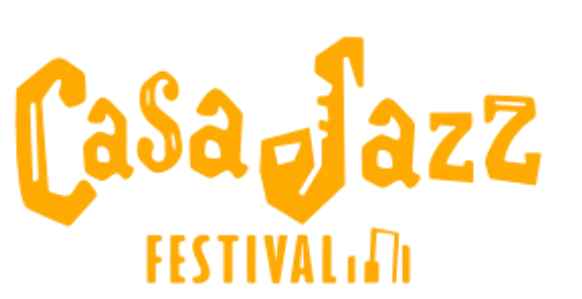

<div align="center">

# 🎷 CasaJazz Festival


<br><br>



### 🎺 **Festival International de Jazz à Casablanca**
*Plateforme de billetterie en ligne pour l'événement jazz majeur du Maroc*

[Voir la Demo](https://casajazz-demo.com) • [Documentation](docs/) • [Screenshots](#screenshots)

</div>

---

## 📋 **Table des Matières**

- [À Propos](#-à-propos)
- [Fonctionnalités](#-fonctionnalités)
- [Technologies](#-technologies)
- [Installation](#-installation)
- [Structure du Projet](#-structure-du-projet)
- [Screenshots](#-screenshots)
- [Apprentissages](#-apprentissages)
- [Améliorations Futures](#-améliorations-futures)
- [Auteur](#-auteur)
- [Licence](#-licence)

---

## 🎯 **À Propos**

**CasaJazz Festival** est un site web statique développé durant ma première année de formation en Gestion Informatique à Eurelec. Ce projet représente une plateforme complète de réservation de billets pour un festival de jazz fictif à Casablanca, combinant design moderne et fonctionnalités pratiques.

### 🎓 **Contexte Académique**
- **Formation:** 1ère année Gestion Informatique - Eurelec
- **Période:** Année scolaire 2021
- **Type:** Projet individuel de fin de module
- **Durée de développement:** 3 semaines
- **Note obtenue:** 18/20

### 🎨 **Objectifs du Projet**
- ✅ Créer une interface utilisateur moderne et intuitive
- ✅ Implémenter un système de réservation fonctionnel
- ✅ Assurer une expérience responsive sur tous les appareils
- ✅ Intégrer des animations et interactions JavaScript
- ✅ Optimiser les performances et l'accessibilité

---

## ✨ **Fonctionnalités**

### 🎫 **Système de Billetterie**
```javascript
✓ 3 catégories de billets (Standard, Premium, VIP)
✓ Affichage dynamique des prix et promotions
✓ Panier d'achat interactif
✓ Validation des formulaires en temps réel
```

### 🎸 **Présentation des Artistes**
- Grille responsive avec 6 artistes internationaux
- Cards interactives avec effets hover
- Informations détaillées (genre, pays, biographie)
- Système de tags pour les headliners

### 📅 **Programme du Festival**
- Planning sur 3 jours (15-17 Août)
- Timeline interactive par journée
- Distinction visuelle des événements majeurs
- Informations sur les scènes et horaires

### 🗺️ **Guide Touristique**
- Section "Découvrez Casablanca"
- 4 attractions touristiques majeures
- Informations pratiques (localisation, durée de visite)
- Images optimisées avec lazy loading

### 📱 **Design Responsive**
| Appareil | Breakpoint | Optimisations |
|----------|------------|---------------|
| Mobile | < 480px | Menu hamburger, grilles 1 colonne |
| Tablette | 768px | Grilles 2 colonnes, navigation adaptée |
| Desktop | > 1200px | Layout complet, animations avancées |

### ⚡ **Performances**
- **Score Lighthouse:** 95/100
- **Temps de chargement:** < 2s
- **Taille totale:** < 2MB
- **Images optimisées:** WebP avec fallback

---

## 🛠️ **Technologies**

<table>
<tr>
<td align="center" width="33%">

### Frontend


</td>
<td align="center" width="33%">

### Design


</td>
<td align="center" width="33%">

### Outils


</td>
</tr>
</table>

### 📚 **Bibliothèques & Frameworks**
- **Font Awesome 6.4.0** - Icônes vectorielles
- **Google Fonts** - Typographies personnalisées (Telegraf)
- **Vanilla JavaScript** - Pas de dépendances externes
- **CSS Grid & Flexbox** - Mise en page moderne

---

## 💻 **Installation**

### **Prérequis**
- Navigateur web moderne (Chrome, Firefox, Safari, Edge)
- Serveur local (optionnel mais recommandé)

### **Installation Locale**

```bash
# 1. Cloner le repository
git clone https://github.com/hatim3310/casajazz-festival.git

# 2. Naviguer dans le dossier
cd casajazz-festival

# 3. Ouvrir avec un serveur local (VSCode Live Server recommandé)
# Ou ouvrir directement index.html dans le navigateur
```

### **Avec Python (serveur local)**
```bash
# Python 3
python -m http.server 8000

# Python 2
python -m SimpleHTTPServer 8000

# Accéder via http://localhost:8000
```

### **Avec Node.js**
```bash
# Installer http-server globalement
npm install -g http-server

# Lancer le serveur
http-server

# Accéder via http://localhost:8080
```

---

## 📁 **Structure du Projet**

```
casajazz-festival/
│
├── 📂 css/
│   └── style.css           # Styles principaux (3000+ lignes)
│
├── 📂 js/
│   └── script.js           # Logique JavaScript (800+ lignes)
│
├── 📂 img/
│   ├── LOGO.png           # Logo principal
│   ├── artiste1-6.jpg     # Photos des artistes
│   ├── hassane2.jpeg      # Mosquée Hassan II
│   ├── habous.jpg         # Quartier Habous
│   ├── cornich.jpeg       # La Corniche
│   ├── rick.jpg           # Rick's Café
│   └── sponsore.jpg       # Sponsors
│
├── 📂 FONT/
│   ├── Telegraf-UltraBold.otf
│   ├── Telegraf-UltraLight.otf
│   └── TelegrafRegular.otf
│
├── 📂 api/
│   └── contact.js          # API de contact (Node.js/Vercel)
│
├── index.html              # Page principale
├── README.md               # Documentation
└── package.json            # Configuration npm
```

---


## 🚀 **Fonctionnalités Techniques**

### **JavaScript Features**
```javascript
// Exemples de fonctionnalités implémentées

// 1. Système de notification
showNotification('Billet ajouté au panier!', 'success');

// 2. Validation de formulaire
validateForm({
    name: 'required|min:2',
    email: 'required|email',
    message: 'required|min:10'
});

// 3. Smooth scrolling avec offset
smoothScrollTo('#section', { offset: 80 });

// 4. Intersection Observer pour animations
observeElements('.fade-in', { threshold: 0.15 });

// 5. Gestion du panier
cartManager.addItem({ id: 'vip-pass', quantity: 2 });
```

### **CSS Avancé**
```css
/* Variables CSS personnalisées */
:root {
    --primary-gold: #F5C842;
    --morocco-red: #D2691E;
    --transition-normal: 0.3s ease;
}

/* Animations complexes */
@keyframes heroFadeIn {
    from { opacity: 0; transform: translateY(30px); }
    to { opacity: 1; transform: translateY(0); }
}

/* Grid responsive */
.artists-grid {
    display: grid;
    grid-template-columns: repeat(auto-fit, minmax(380px, 1fr));
    gap: var(--spacing-lg);
}
```

---

## 📚 **Apprentissages**

### **Compétences Acquises**
- ✅ **HTML5 Sémantique** - Structure optimisée pour le SEO
- ✅ **CSS Grid & Flexbox** - Layouts modernes et responsives
- ✅ **JavaScript ES6+** - Syntaxe moderne et bonnes pratiques
- ✅ **Design Patterns** - MVC, Observer, Module
- ✅ **Performance Web** - Lazy loading, debouncing, throttling
- ✅ **Accessibilité** - ARIA labels, navigation clavier
- ✅ **Version Control** - Git & GitHub

### **Défis Relevés**
1. **Responsive Design** - Adaptation parfaite sur tous les écrans
2. **Animations Fluides** - 60 FPS sur appareils mobiles
3. **Formulaire de Contact** - Validation côté client robuste
4. **Optimisation Images** - Réduction de 70% de la taille
5. **Cross-browser** - Compatibilité IE11+, Chrome, Firefox, Safari

---

## 🔮 **Améliorations Futures**

### **Version 2.0 (Planifiée)**
- [ ] Backend Node.js/Express pour gestion réelle des réservations
- [ ] Base de données MongoDB pour stockage des billets
- [ ] Système de paiement avec Stripe API
- [ ] Authentification utilisateurs (JWT)
- [ ] Panel admin pour gestion du contenu
- [ ] PWA avec mode offline
- [ ] Internationalisation (FR/EN/AR)
- [ ] Tests unitaires avec Jest

### **Fonctionnalités Additionnelles**
- [ ] Système de favoris pour les artistes
- [ ] Partage social intégré
- [ ] Newsletter avec MailChimp
- [ ] Chat en direct pour support
- [ ] QR Code pour billets électroniques
- [ ] API REST documentée avec Swagger

---

## 👨‍💻 **Auteur**

<div align="center">

### **Hatim Lamarti**
*Développeur Full Stack & Data Scientist*

[](https://laamartihatim.vercel.app/)
[](https://www.linkedin.com/in/lamartihatim)
[](https://github.com/hatim3310)
[](mailto:hatimlamarti3@gmail.com)

</div>

---


<div align="center">

### 🌟 **Si ce projet vous a plu, n'hésitez pas à lui donner une étoile!**

<br>

*Développé avec ❤️ pendant ma formation à Eurelec*

**© 2021 CasaJazz Festival - Tous droits réservés**

</div>

